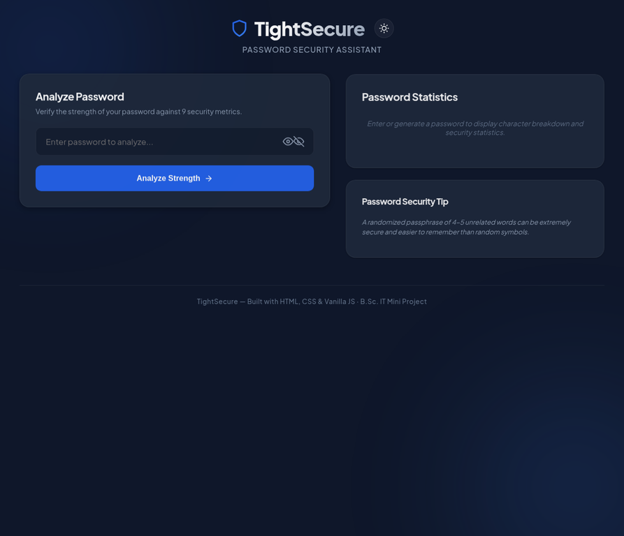

# Tight Secure

> A **local-first password generator and strength analyser** for creating stronger passwords and understanding common password risks.

[Open the live demo](https://tightsecure.vercel.app) · [View the source](https://github.com/theneotic/tightsecure)

## Live interface

<p align="center">
  <a href="https://tightsecure.vercel.app">
    
  </a>
</p>

<p align="center"><sub>Live interface captured from the public demo. Select the image to open Tight Secure.</sub></p>

## Features

| Feature | What it provides |
|---|---|
| Strength analysis | Reviews password length, character variety, and practical strength signals before presenting guidance. |
| Live statistics | Shows the password-character breakdown and related security statistics after analysis. |
| Password generation | Builds a new password from a chosen length and selected uppercase, lowercase, numeric, and symbol sets. |
| Actionable feedback | Provides a strength state, requirements checklist, and estimated crack-time guidance. |
| Local interaction | Runs in the browser without an account or server-side database. |

## What it does

Tight Secure has two browser-based tools. The **Generator** creates passwords with a chosen length and selected character types: uppercase letters, lowercase letters, numbers, and symbols. The **Analyser** checks a password against practical strength signals, including length and character variety, then presents a strength state and estimated crack-time guidance.

## Local-first design

Password input is handled in the browser by the application’s client-side JavaScript. The project does not need an account, server-side database, or setup step to use its generator and analyser.

> Password-strength estimates are educational guidance, not a guarantee that a password cannot be compromised. Use a unique password for every account and store it in a trusted password manager.

## Run it locally

```bash
git clone https://github.com/theneotic/tightsecure.git
cd tightsecure
```

Open `index.html` in a current browser. The project is a static site, so no package installation or server process is required.

## Project focus

| Area | Implementation |
|---|---|
| Password generation | Configurable length and character-set controls |
| Password analysis | Strength meter, requirements checklist, and crack-time estimate |
| Privacy | Browser-side interaction with no account requirement |
| Delivery | Static HTML, CSS, and JavaScript |

## Repository structure

```text
index.html       Application shell and interface
css/             Visual styling
js/              Generator and analyser behaviour
README.md        Project documentation
```

---

Built as a compact, accessible password-security learning tool.
