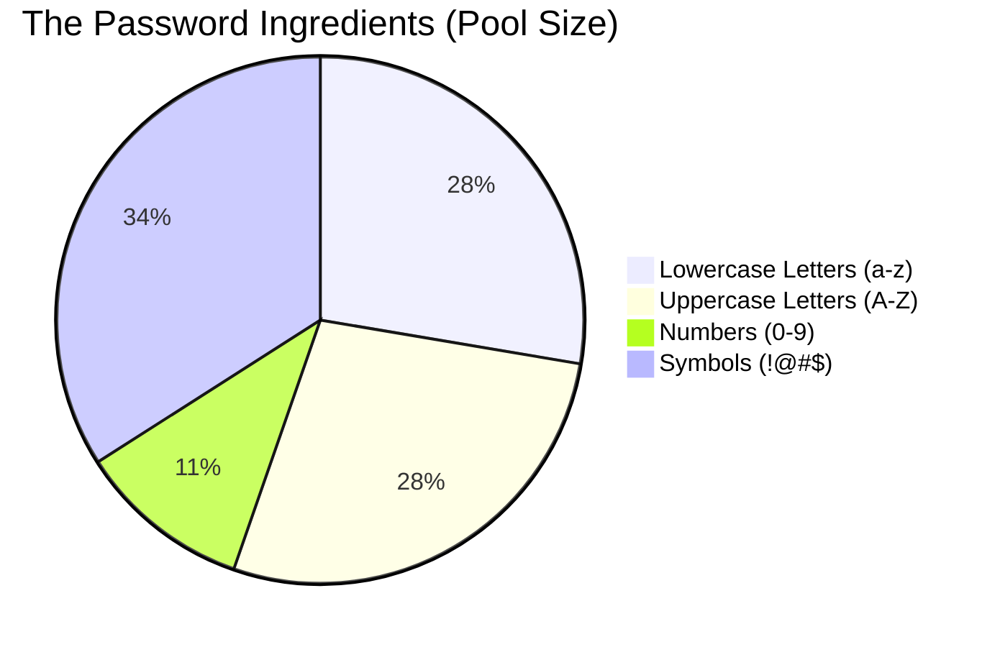

# 🛡️ Monolith Vault 
**A Zero-Knowledge Cryptographic Generator & Real-Time Entropy Analyzer**

<div align="center">
  
  <br>
  <i>(Tip: Record a quick screen recording of your app using a tool like LICEcap or Giphy and replace the image link above with your `.gif` file!)</i>
</div>

---

## 🎮 What Does This Do? (The Simple Version)

Imagine you are buying a padlock for your bicycle. 

* **A Weak Password** is like a padlock with only 3 numbers on it. A thief could just sit there and guess every combination (001, 002, 003...) until it pops open. 
* **A Strong Password** is like a padlock with 100 dials, where each dial has numbers, letters, and alien symbols. It would take a thief a million years to guess every combination!

**Monolith Vault does two things:**
1. **The Generator:** It builds the ultimate "alien padlock" for you instantly.
2. **The Analyzer:** You can type any password into it, and it acts like a security expert, telling you exactly how long it would take a hacker's supercomputer to guess it.

---

## 📊 How The Analyzer Thinks (Interactive Charts)

GitHub automatically turns the code blocks below into visual charts! 

### 1. The Character Pool Breakdown
When the app calculates how strong your password is, it looks at how many *types* of characters you used. Here is a pie chart of the "Pool Size":



### 2. The Zero-Knowledge Flow
Most websites send your password over the internet to check it. That's dangerous! **Monolith Vault** is "Zero-Knowledge," meaning it traps everything inside your computer. 

```mermaid
graph TD
    A[You Type a Password] -->|Keystroke| B(Your Browser)
    B --> C{Internet Connection?}
    C -->|Blocked!| D[External Servers]
    B --> E[Monolith Vault Logic]
    E -->|Math Magic| F((Strength Score))
    style A fill:#1E1E1E,stroke:#06b6d4,stroke-width:2px
    style D fill:#ef4444,stroke:#333,stroke-width:2px
    style F fill:#10b981,stroke:#333,stroke-width:2px
```



---

## 🧮 For the Geeks: The Math Behind the Magic

<details>
<summary><strong>👉 Click here to reveal the theoretical cryptography math!</strong></summary>

<br>
The core logic of the Analyzer relies on <strong>Shannon Entropy</strong>, a concept derived from Information Theory. Entropy measures the inherent unpredictability of a password and is measured in "bits." 

A password's strength is a combination of its **Length** ($L$) and the **Pool of Possible Characters** ($R$).

The exact formula used in the application's JavaScript backend is:

$$E = L \times \log_2(R)$$

Where:
* **$E$** = Entropy in bits.
* **$L$** = Total number of characters in the password.
* **$R$** = The size of the character pool used (see pie chart above).

**Example:**
If you type a 10-character password using only lowercase letters and numbers, the pool size ($R$) is $26 + 10 = 36$. 
The entropy would be: $10 \times \log_2(36) \approx 51.7$ bits.

</details>

---

## 🚀 Setup & Installation (Interactive Steps)

Because this is a secure client-side application, you don't need servers or complex databases. Anyone can run it in 10 seconds.

<details>
<summary><strong>Step 1: Download the Vault</strong></summary>
<br>
Open your terminal and clone this repository to your computer:

```bash
git clone https://github.com/your-username/monolith-vault.git
```
</details>

<details>
<summary><strong>Step 2: Enter the Directory</strong></summary>
<br>

```bash
cd monolith-vault
```
</details>

<details>
<summary><strong>Step 3: Launch it!</strong></summary>
<br>
Simply double-click the `index.html` file to open it in Chrome, Firefox, or Safari. It works entirely offline!
</details>

---

## 🎓 Academic Context

This project was engineered to demonstrate proficiency in core web technologies and software architecture principles, fitting the rigorous requirements of a Bachelor of Science in Information Technology framework. 

* **Frontend Structure:** Semantic HTML5 ensuring accessibility.
* **Styling:** CSS3 utilizing CSS Variables for global state management and high-contrast dark mode aesthetics.
* **Logic & Interactivity:** Modular Vanilla JavaScript (ES6+) decoupled into independent processing domains. No abstract frameworks or third-party APIs were used, emphasizing secure, ground-up coding practices.

> *"Security is not a product, but a process." — Bruce Schneier*
